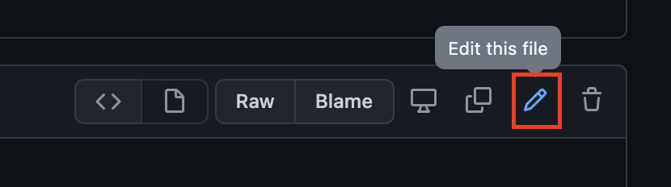
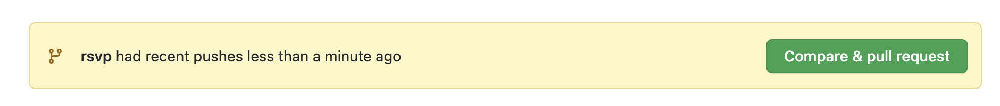
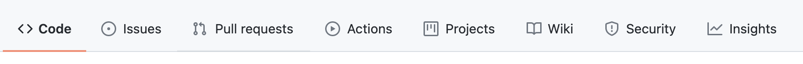
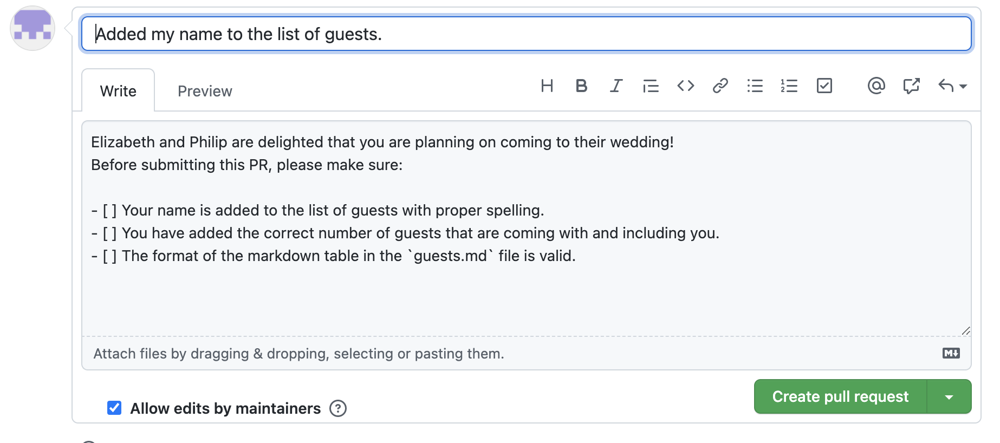

# Elizabeth & Philip
Elizabeth and Philip are inviting everyone to their wedding! They would like all the guests to RSVP to their wedding by adding their name to the list of the guests in this repository.

Let Elizabeth and Philip know if you can make it to their wedding by following the instructions. 

# How to RSVP? 
There are several possible methods to make a change in a public Github repository. Below we discuss two ways; 1) Through the Github web interface, and 2) By git comman line. 

## Github Web Interface 

### Assumptions
- You have a Github user account
- You have basic familiarity with Markdown

### Instructions
1. Start by forking the repository to your Github user account. A fork is a copy of a repository. Forking a repository allows you to make changes to a copy of the repository stored in your own Github account without impacting the public repository. 
Fork the repository by clicking on the fork button at the top right corner. 


When you fork the repository, the counter number next to the Fork button on the public repository will be incremented. This indicates how many users have forked this repository. That is the only change you see on the public repository side. Feel free to experiment with the forked copy of the repository in your own Github account. 

2. In the forked copy of the repository in your Github account, click on the drop down menu that shows `main`. This is the current branch of the repository displayed. The dropdown manu shows other available branches in the repository and also enables you to create a new branch. 
Create a new branch named `rsvp`.


3. On the `rsvp` branch, open the `guests.md` file and then click on the little pencil button that says `Edit this file`. 



4. The `guests.md` file is a Markdown table that includes the list of all the guests who have RSVPed to the wedding. Add a new row to the table and include your name and the number of guests coming with you. 

5. Scroll down and "commit" your changes. This way Git tracks the change. Add a short message describing the change. You also have an option to include a more verbose description of the change. Then commit your chnage to your `rsvp` branch. 


Once you commit the change, Github immediately takes you to a pull request creation page so that you can create a PR from your branch to the main branch of your forked repository. However, we are planning on creating a pull request from your feature branch to the main branch of the public and origiranl repository. Therefore, ignore and click on code to open your repository page. 

6. On the main page of your repository, you will see a new `Compare and pull request` button. Click on that to create a pull request from the `rsvp` branch of your forked repository to the `main` branch of the original repository. 



Alternatively, you can manually create a pull request by clicking on the pull request button: 



And then click on `Create pull request` and specify the source branch as the `rsvp` branch from the forked repository on your Github account to the `main` branch of the original repository. 

7. When you are about to create a pull request, Github shows a draft view of the changes and differences between the source and target branches. 
Click on `Create pull request` to open the fields to set the title and description of a the pull request. 



8. Github by default puts the message of the latest commit as the title of the pull request. Update the title to something descriptive of the change. 
The description of the pull request is already filled with a template message. This message comes from the content of a markdown file at `docs/pull_request_template.md`. If such a file exists, Github uses it as a template for all the pull requests created from a branch to the main branch. 

9. Create the pull request and ensure all the requirements outlined in the checkboxes are met. 

## Git Command Line

### Assumptions
- You have a Github user account
- You have basic familiarity with Markdown
- You have Git command line installed on your computer and it is set up to access your Github account 

### Instructions
1. Start by forking the main repository into your Github account. This step is identical to the first step should you decided to use the Github web interface. 

2. Next clone the forked repository from your Github account in your local computer. In order to clone, you need the URL of the repository. Click on the `Code` button to access the direct url of the repository. 


Run the following command in your terminal. The command copies the repository to your local computer and at the current directory of the terminal.

```
git clone https://github.com/mesabacodes/WeddingInvitation.git
```

3. Next change your current directory of the terminal to the directory of the repository.

```
cd WddingInvitation
```

4. Create a new branch and name it `rsvp`. The following command creates the new branch and also changes the current working branch of the local repository to the newly created branch.

```
git checkout -b rsvp
```

5. Open the `guests.md` file using a text editor. This is a Markdown table that includes the list of all the guests who have RSVPed to the wedding. Add a new row to the table and include your name and the number of guests coming with you. Save your changes to the file. 

6. Commit your changes for Git to track. Put a message describing the change for your commit.

```
git commit -m "Added my name to the list of guests."
```

7. Push your changes to the forked repository in your github account.

```
git push
```

8. You have all your changes in the repository ready to make a pull request. Open the repository on Github web interface and follow the instructions under Github Web Interface starting at step six. 
